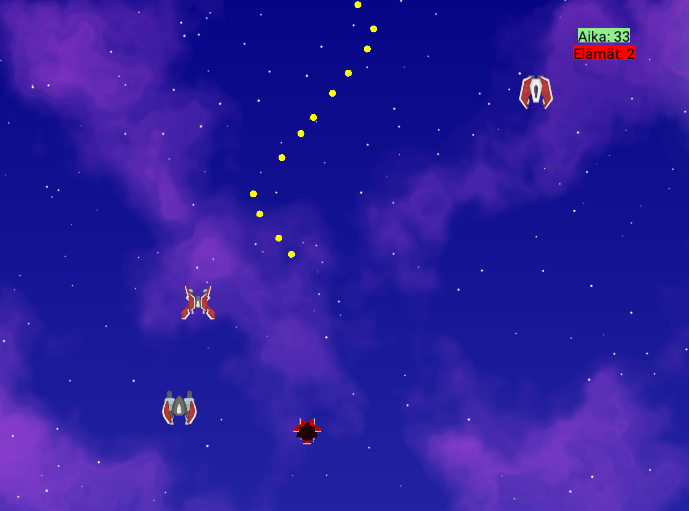

# Väistä (Bullet Hell)

Väistä on C#:lla ja Jypeli-pelimoottorilla toteutettu "Bullet Hell" -tyylinen selviytymispeli. Pelin tavoitteena on väistellä vihollisia, ampua niitä ja selviytyä hengissä määrätyn ajan loppuun asti.

## 🎮 Pelin Idea

Pelaaja ohjaa hahmoa, joka liikkuu ruudulla. Ylhäältä satelee satunnaisesti erityyppisiä vihollisia, joita on väisteltävä.

* **Voitto:** Selviydy hengissä 50 sekuntia.
* **Häviö:** Peli päättyy, jos menetät kaikki elämäsi törmäämällä vihollisiin.
* **Elämät:** Aloitat yhdellä elämällä. Saat automaattisesti yhden lisäelämän aina 10 sekunnin välein.

## 🕹️ Kontrollit

Peliä ohjataan näppäimistöllä:

| Toiminto | Näppäin |
| :--- | :--- |
| **Liikkuminen** | Nuolinäppäimet (Ylös, Alas, Vasen, Oikea)  |
| **Ampuminen** | Z  |
| **Lopetus** | ESC |

## 🛠️ Teknologiat

Projekti on rakennettu seuraavilla teknologioilla:

* **Kieli:** C#
* **Kehys:** .NET 8.0
* **Pelimoottori:** Jypeli.NET
* **Fysiikkamoottori:** Jypeli.FarseerPhysics.NET

## 📂 Projektin Rakenne

* **Vaista.cs:** Sisältää pääasiallisen pelilogiikan, kuten fysiikkaobjektien luonnin, törmäyskäsittelyt (CollisionHandler) ja pelisilmukan.
* **Ohjelma.cs:** Sovelluksen käynnistyspiste (Main-metodi).
* **Content-kansio:** Sisältää pelin assetit (kuvat ja äänitiedostot), kuten `pelaaja.png`, `vihu.png` ja ääniefektit.

## 🎮 Kuvakaappaus pelistä

